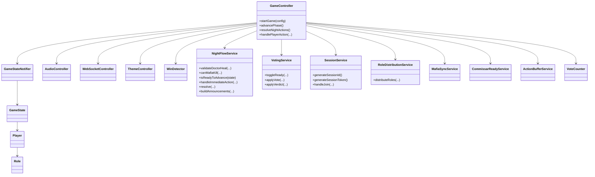

# Class Diagram

```mermaid
classDiagram
  class GameController {
    +startGame(config)
    +advancePhase()
    +resolveNightActions()
    +handlePlayerAction(...)
  }

  class GameStateNotifier
  class GameState
  class Player
  class Role

  class AudioController
  class WebSocketController
  class ThemeController
  class WinDetector

  class NightFlowService {
    +validateDoctorHeal(...)
    +canMafiaKill(...)
    +isReadyToAdvance(state)
    +handleImmediateAction(...)
    +resolve(...)
    +buildAnnouncements(...)
  }

  class VotingService {
    +toggleReady(...)
    +applyVote(...)
    +applyVerdict(...)
  }

  class SessionService {
    +generateSessionId()
    +generateSessionToken()
    +handleJoin(...)
  }

  class RoleDistributionService {
    +distributeRoles(...)
  }

  class MafiaSyncService
  class CommissarReadyService
  class ActionBufferService
  class VoteCounter

  GameController --> AudioController
  GameController --> WebSocketController
  GameController --> ThemeController
  GameController --> WinDetector
  GameController --> GameStateNotifier

  GameController --> NightFlowService
  GameController --> VotingService
  GameController --> SessionService
  GameController --> RoleDistributionService

  GameController --> MafiaSyncService
  GameController --> CommissarReadyService
  GameController --> ActionBufferService
  GameController --> VoteCounter

  GameStateNotifier --> GameState
  GameState --> Player
  Player --> Role
```
