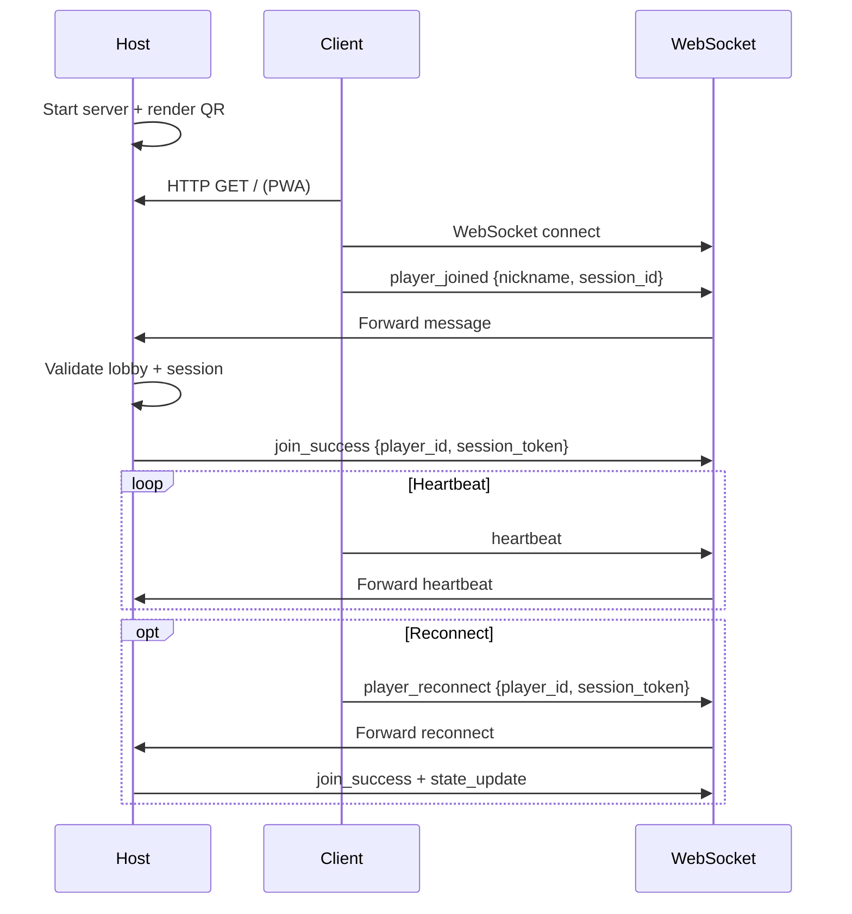

# Connection Flow

```mermaid
sequenceDiagram
  participant Host
  participant Client
  participant WS as WebSocket

  Host->>Host: Start server + render QR
  Client->>Host: HTTP GET / (PWA)
  Client->>WS: WebSocket connect
  Client->>WS: player_joined {nickname, session_id}
  WS->>Host: Forward message
  Host->>Host: Validate lobby + session
  Host->>WS: join_success {player_id, session_token}

  loop Heartbeat
    Client->>WS: heartbeat
    WS->>Host: Forward heartbeat
  end

  opt Reconnect
    Client->>WS: player_reconnect {player_id, session_token}
    WS->>Host: Forward reconnect
    Host->>WS: join_success + state_update
  end
```
