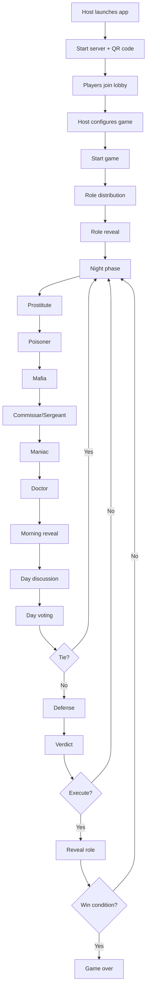

# Game Flow

```mermaid
flowchart TD
  A[Host launches app] --> B[Start server + QR code]
  B --> C[Players join lobby]
  C --> D[Host configures game]
  D --> E[Start game]
  E --> F[Role distribution]
  F --> G[Role reveal]
  G --> H[Night phase]

  H --> H1[Prostitute]
  H1 --> H2[Poisoner]
  H2 --> H3[Mafia]
  H3 --> H4[Commissar/Sergeant]
  H4 --> H5[Maniac]
  H5 --> H6[Doctor]

  H6 --> I[Morning reveal]
  I --> J[Day discussion]
  J --> K[Day voting]
  K --> L{Tie?}
  L -- Yes --> H
  L -- No --> M[Defense]
  M --> N[Verdict]
  N --> O{Execute?}
  O -- No --> H
  O -- Yes --> P[Reveal role]
  P --> Q{Win condition?}
  Q -- Yes --> R[Game over]
  Q -- No --> H
```
